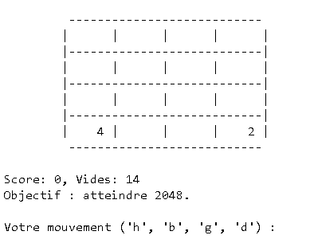

# 🔢 2048 en C++ – Jeu de console interactif

 <!-- Remplace par ton image -->

## 📝 Description

Jeu **2048** en mode **console** entièrement codé en **C++**.  
Le joueur déplace les tuiles avec les touches `h`, `b`, `g`, `d` (haut, bas, gauche, droite) dans le but d’atteindre une tuile avec la valeur cible (par défaut 2048).


---

## 🚀 Fonctionnalités

- 🎯 Objectif personnalisable (ex : 2048, 4096…)
- 📏 Grille personnalisable (4x4, 5x5, etc.)
- 🧠 Logique complète du jeu (mouvements, fusions, fin de partie)
- 🧪 Fonctions de test intégrées 
- 🔄 Partie rejouable en boucle

---

## 🛠️ Technologies utilisées

- [C++](https://fr.cppreference.com/w/) 
- [Makefile](https://www.gnu.org/software/make/manual/make.html) 
- [iostream](https://en.cppreference.com/w/cpp/header/iostream) 
- [vector](https://en.cppreference.com/w/cpp/container/vector) 
- [cassert](https://en.cppreference.com/w/cpp/header/cassert) 
- [cstdlib](https://en.cppreference.com/w/cpp/header/cstdlib), [ctime](https://en.cppreference.com/w/cpp/header/ctime)

---

## ⚙️ Comment utiliser ce projet

```bash
# 1. Cloner le dépôt
git clone https://github.com/ton-user/2048-cpp.git
cd 2048-cpp

# 2. Lancer le jeu
make jeu

